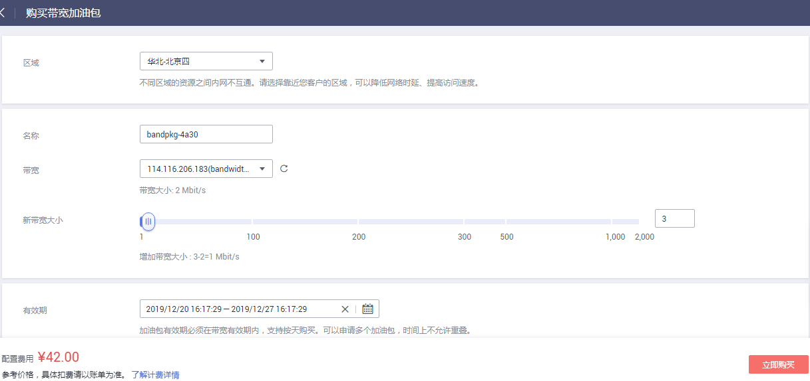

# 修改带宽大小

## 操作场景

您可以对弹性公网IP的带宽大小进行修改，即对带宽进行升配和降配操作。

修改带宽大小对费用影响如下：

**表 1**  费用影响

<table><thead align="left"><tr id="zh-cn_topic_0118498819_row2070710212517"><th class="cellrowborder" valign="top" width="14.04%" id="mcps1.2.4.1.1">
当前计费模式

</th>
<th class="cellrowborder" valign="top" width="18.91%" id="mcps1.2.4.1.2">
变更场景

</th>
<th class="cellrowborder" valign="top" width="67.05%" id="mcps1.2.4.1.3">
对费用的影响

</th>
</tr>
</thead>
<tbody><tr id="row129737166211"><td class="cellrowborder" valign="top" width="14.04%" headers="mcps1.2.4.1.1 ">
按需

</td>
<td class="cellrowborder" valign="top" width="18.91%" headers="mcps1.2.4.1.2 ">
带宽大小变更（升配/降配）

</td>
<td class="cellrowborder" valign="top" width="67.05%" headers="mcps1.2.4.1.3 ">
变更成功后，新的计费方式将立即生效。

</td>
</tr>
<tr id="zh-cn_topic_0118498819_row6707727518"><td class="cellrowborder" rowspan="3" valign="top" width="14.04%" headers="mcps1.2.4.1.1 ">
包年包月

</td>
<td class="cellrowborder" valign="top" width="18.91%" headers="mcps1.2.4.1.2 ">
增加带宽大小（补差价升配）

</td>
<td class="cellrowborder" valign="top" width="67.05%" headers="mcps1.2.4.1.3 ">
升配后新带宽大小将在原来已有的时间周期内立即生效。需按照与原规格的价格差异，结合已使用的时间周期，补上差价。

例如：（以下价格仅作示例，实际价格以<a href="https://www.huaweicloud.com/pricing.html#/eip" target="_blank" rel="noopener noreferrer">价格详情</a>为准）

客户于2018/11/1 购买了1Mbit/s的带宽，购买时长为1个月，此时价格为18.4元/月，客户使用余额支付18.4元，实付金额为18.4元。

客户在2018/11/24 将带宽升级为5Mbit/s，价格为92元/月。

这时，剩余天数为 30 - 24 = 6天，升配费用=92 / 30 * 6 - 18.4 / 30 * 6 = 14.72元。

了解更多变更资源计费信息，请参见<a href="https://support.huaweicloud.com/usermanual-billing/zh-cn_topic_0045348012.html" target="_blank" rel="noopener noreferrer">变更资源费用说明</a>。

</td>
</tr>
<tr id="zh-cn_topic_0118498819_row1616328121117"><td class="cellrowborder" valign="top" headers="mcps1.2.4.1.1 ">
降低带宽大小（续费降配）

</td>
<td class="cellrowborder" valign="top" headers="mcps1.2.4.1.2 ">
续费成功后新的带宽大小将在新的计费周期生效。

<ul id="zh-cn_topic_0118498819_ul178551434171416"><li>续费降配订单支付成功后不可取消。</li><li>续费降配后，当前计费周期的剩余时间内不能再对带宽进行任何修改，请谨慎操作。</li></ul>
</td>
</tr>
<tr id="row1942717113405"><td class="cellrowborder" valign="top" headers="mcps1.2.4.1.1 ">
临时升配（使用带宽加油包临时升配）

</td>
<td class="cellrowborder" valign="top" headers="mcps1.2.4.1.2 ">
带宽加油包提供包年/包月带宽临时调整带宽使用。您可以在带宽生命周期内选择任意时间段增加临时带宽，带宽加油包到期后带宽自动回落。

</td>
</tr>
</tbody>
</table>

## 操作步骤

1.  登录管理控制台。
2.  在管理控制台左上角单击，选择区域和项目。
3.  在系统首页，选择“网络 \> 虚拟私有云”。
4.  在左侧导航树，选择“弹性公网IP和带宽 \> 弹性公网IP”。
5.  在“操作”列，选择“修改带宽”。
    -   按需带宽将直接进入“修改带宽”页面。
    -   包年包月带宽可根据需求选择以下任一种带宽变更方案，并单击“继续”。
        -   补差价升配
        -   续费降配
        -   使用带宽加油包临时升配

6.  根据界面提示修改带宽大小。

    **图 1**  修改按需带宽大小  
    

    **图 2**  修改包年包月带宽大小  
    

    **图 3**  使用带宽加油包临时升配  
    

    > **说明：**   
    >-   同时您也可以修改带宽名称和按需带宽的计费方式。  
    >-   了解更多带宽加油包信息，请参见[带宽加油包简介](带宽加油包简介.md)。  

7.  单击“下一步”。
8.  单击“提交”，完成修改。

您还可以同时勾选多个弹性公网IP，单击列表上方的“修改带宽”，批量修改多个弹性公网IP的带宽。

批量修改操作仅支持按需且独享的带宽。

