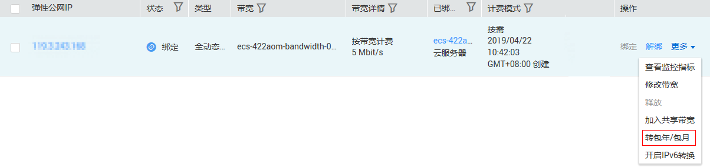
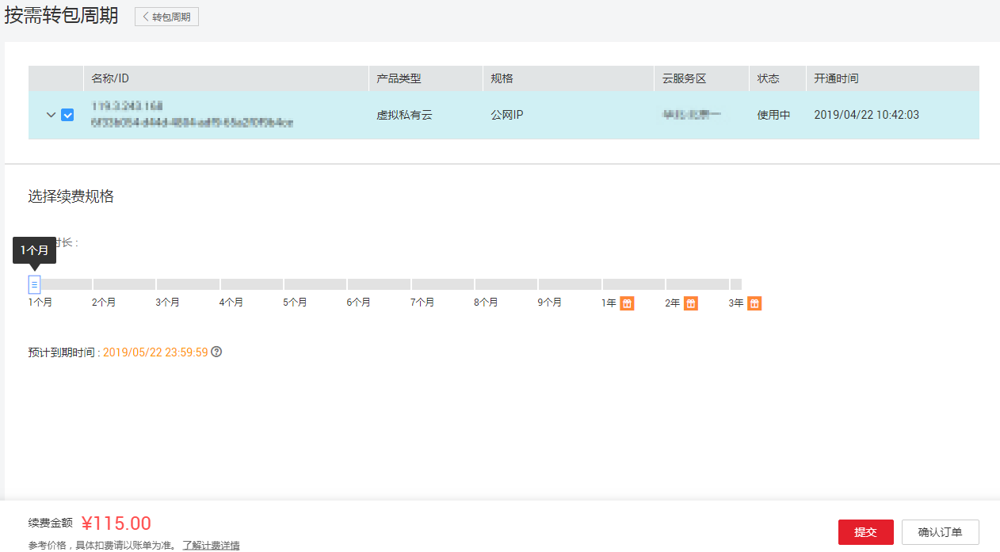
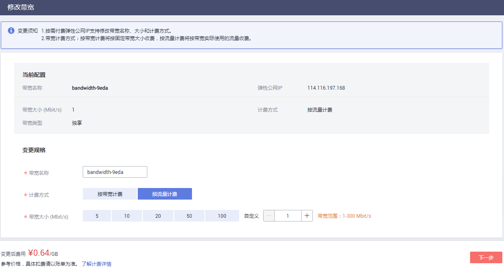

# 修改带宽计费方式

## 操作场景

您可以对带宽计费方式进行修改。

变更弹性公网IP计费模式不会改变弹性公网IP地址。

弹性公网IP的计费方式如下：

**表 1**  弹性公网IP的计费方式

<table><thead align="left"><tr id="row18713163420163"><th class="cellrowborder" valign="top" width="13.650000000000004%" id="mcps1.2.5.1.1">
计费模式

</th>
<th class="cellrowborder" valign="top" width="13.390000000000002%" id="mcps1.2.5.1.2">
计费方式

</th>
<th class="cellrowborder" valign="top" width="30.900000000000006%" id="mcps1.2.5.1.3">
计费特点

</th>
<th class="cellrowborder" valign="top" width="42.06%" id="mcps1.2.5.1.4">
适用场景

</th>
</tr>
</thead>
<tbody><tr id="row1271373419165"><td class="cellrowborder" valign="top" width="13.650000000000004%" headers="mcps1.2.5.1.1 ">
包年包月

</td>
<td class="cellrowborder" valign="top" width="13.390000000000002%" headers="mcps1.2.5.1.2 ">
按带宽计费

</td>
<td class="cellrowborder" valign="top" width="30.900000000000006%" headers="mcps1.2.5.1.3 ">
包年包月计费、带宽固定、不限流量

</td>
<td class="cellrowborder" valign="top" width="42.06%" headers="mcps1.2.5.1.4 ">
适用于流量大或访问量稳定场景

</td>
</tr>
<tr id="row371311345166"><td class="cellrowborder" rowspan="3" valign="top" width="13.650000000000004%" headers="mcps1.2.5.1.1 ">
按需

</td>
<td class="cellrowborder" valign="top" width="13.390000000000002%" headers="mcps1.2.5.1.2 ">
按带宽计费

</td>
<td class="cellrowborder" valign="top" width="30.900000000000006%" headers="mcps1.2.5.1.3 ">
带宽固定、不限流量、按需计费

</td>
<td class="cellrowborder" valign="top" width="42.06%" headers="mcps1.2.5.1.4 ">
适用于流量大或访问量稳定场景

</td>
</tr>
<tr id="row117149340166"><td class="cellrowborder" valign="top" headers="mcps1.2.5.1.1 ">
按流量计费

</td>
<td class="cellrowborder" valign="top" headers="mcps1.2.5.1.2 ">
选择带宽上限, 按使用流量收费（每小时计费)

</td>
<td class="cellrowborder" valign="top" headers="mcps1.2.5.1.3 ">
适用于流量低或访问量波动较大场景

</td>
</tr>
<tr id="row559019360171"><td class="cellrowborder" valign="top" headers="mcps1.2.5.1.1 ">
加入共享带宽

</td>
<td class="cellrowborder" valign="top" headers="mcps1.2.5.1.2 ">
加入共享带宽, 多IP聚合计费

</td>
<td class="cellrowborder" valign="top" headers="mcps1.2.5.1.3 ">
适用于多业务流量高峰分布于不同时段, 需节约公网成本场景

</td>
</tr>
</tbody>
</table>

计费方式间的变更关系如[图1](#fig1663143473912)。

**图 1**  计费变更  

**表 2**  费用影响

<table><thead align="left"><tr id="zh-cn_topic_0118498819_row2070710212517"><th class="cellrowborder" valign="top" width="14.04%" id="mcps1.2.4.1.1">
当前计费模式

</th>
<th class="cellrowborder" valign="top" width="19.13%" id="mcps1.2.4.1.2">
变更场景

</th>
<th class="cellrowborder" valign="top" width="66.83%" id="mcps1.2.4.1.3">
对费用的影响

</th>
</tr>
</thead>
<tbody><tr id="row9323183082818"><td class="cellrowborder" rowspan="2" valign="top" width="14.04%" headers="mcps1.2.4.1.1 ">
按需

</td>
<td class="cellrowborder" valign="top" width="19.13%" headers="mcps1.2.4.1.2 ">
按流量计费与按带宽计费间变更

</td>
<td class="cellrowborder" valign="top" width="66.83%" headers="mcps1.2.4.1.3 ">
变更后新的计费方式将立即生效。

</td>
</tr>
<tr id="zh-cn_topic_0118498819_row1211891016159"><td class="cellrowborder" valign="top" headers="mcps1.2.4.1.1 ">
转包年包月

</td>
<td class="cellrowborder" valign="top" headers="mcps1.2.4.1.2 ">
您可以在弹性公网IP页面或费用中心转包年包月，变更成功后，新的计费模式将立即生效。

按需按流量计费的弹性公网IP不能直接转包年包月，需要先修改为按需按带宽计费，然后再转包年包月。

</td>
</tr>
<tr id="zh-cn_topic_0118498819_row128237518151"><td class="cellrowborder" valign="top" width="14.04%" headers="mcps1.2.4.1.1 ">
包年包月

</td>
<td class="cellrowborder" valign="top" width="19.13%" headers="mcps1.2.4.1.2 ">
转按需

</td>
<td class="cellrowborder" valign="top" width="66.83%" headers="mcps1.2.4.1.3 ">
您可以在费用中心转按需，包年包月资费到期后，新的按需资费才会生效。

包年包月转按需只能变更为按需按带宽计费。如想变更为按需按流量计费，请在包年包月转按需变更成功后，通过修改带宽规格，变更为按流量计费。

</td>
</tr>
</tbody>
</table>

## 按需转包年包月

您可以在对应资源页面进行修改，如下为按需按带宽的弹性公网IP转包年包月的操作指导。

1.  登录管理控制台。
2.  在服务列表中，选择“网络 \> 弹性公网IP”。
3.  在右侧资源列表中搜索需要切换计费模式的弹性公网IP。
4.  在弹性公网IP所在行的“操作”列下，单击“转包年/包月”。

    **图 2**  在资源页面转包年包月  
    

5.  单击“是”，确认转包年包月。
6.  设置包年包月规格。

    **图 3**  包年包月规格  
    

7.  单击“提交”。

在资源页面，您还可以同时勾选多个资源，单击列表上方的“转包年/包月”，批量转包年包月。

## 包年包月转按需

您可以在费用中心进行修改，如下为包年包月的弹性公网IP转按需计费的操作指导。

1.  登录管理控制台。
2.  选择“费用 \> 续费管理”。

    **图 4**  续费管理  
    

3.  在右侧资源列表中搜索需要切换计费模式的弹性公网IP资源。
4.  在弹性公网IP资源所在行的“操作”列下，单击“转按需”。

    **图 5**  转按需  
    

5.  单击“转按需”，完成转按需计费模式变更。

    **图 6**  确认转按需  
    

## 按流量与按带宽计费切换

1.  登录管理控制台。
2.  在管理控制台左上角单击，选择区域和项目。
3.  在系统首页，选择“网络 \> 虚拟私有云”。
4.  在左侧导航树，选择“弹性公网IP和带宽 \> 弹性公网IP”。
5.  在“操作”列，选择“修改带宽”。
6.  根据界面提示修改计费方式。

    **图 7**  修改按需带宽计费方式  
    

    > **说明：**   
    >同时您也可以修改带宽名称和带宽大小。  

7.  单击“下一步”。
8.  单击“提交”，完成修改

