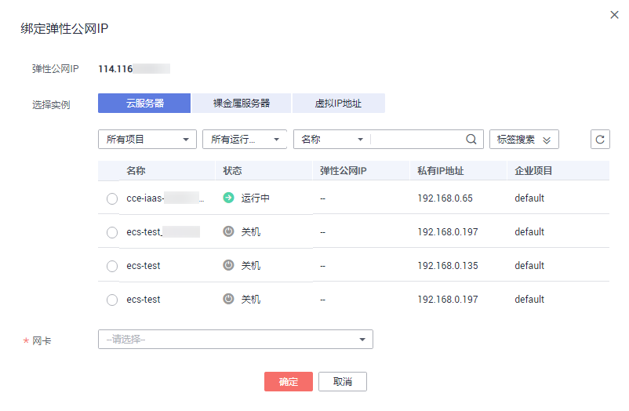

# 绑定云资源

## 操作场景

弹性公网IP申请成功后，将弹性公网IP绑定到弹性云服务器、裸金属服务器、虚拟IP、弹性负载均衡、NAT网关等资源上，可实现与公网的连接。

## 操作步骤

**绑定弹性云服务器、裸金属服务器、虚拟IP**

1.  在“弹性公网IP”界面待绑定弹性公网IP地址所在行，单击“绑定”。
2.  选择实例。

    **图 1**  绑定云资源  
    

3.  单击“确定”。

**绑定NAT网关**

NAT网关与弹性公网IP绑定后，可以使多个云主机共享弹性公网IP访问Internet或使云主机提供互联网服务。

通过配置NAT网关的SNAT规则与DNAT规则，可实现与弹性公网IP的绑定。具体操作请参见[使用SNAT访问公网](https://support.huaweicloud.com/qs-natgateway/zh-cn_topic_0087895790.html)和[使用DNAT为云主机面向公网提供服务](https://support.huaweicloud.com/qs-natgateway/nat_qs_0007.html)。

**绑定弹性负载均衡**

为负载均衡器绑定一个弹性公网IP。绑定后，负载均衡器便可以转发来自公网的请求。具体操作请参见[为实例绑定/解绑EIP](https://support.huaweicloud.com/usermanual-elb/elb_ug_fz_0009.html)。

